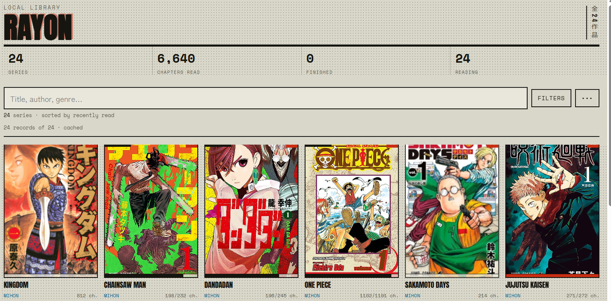
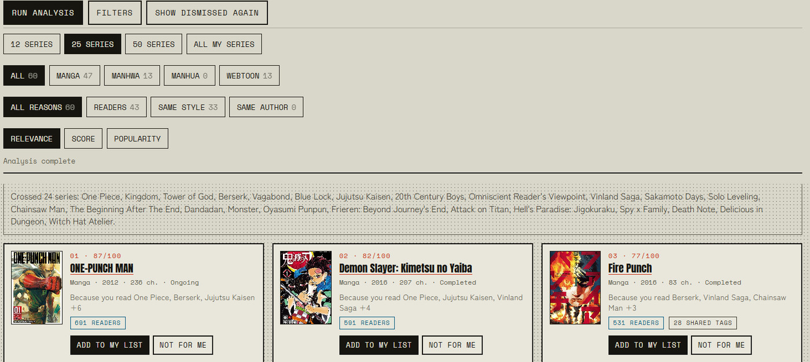
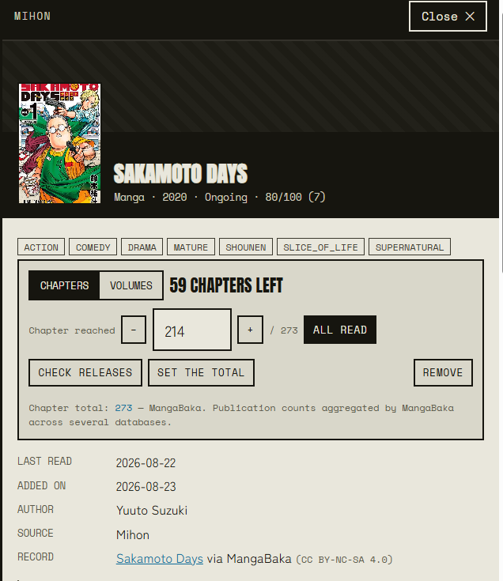
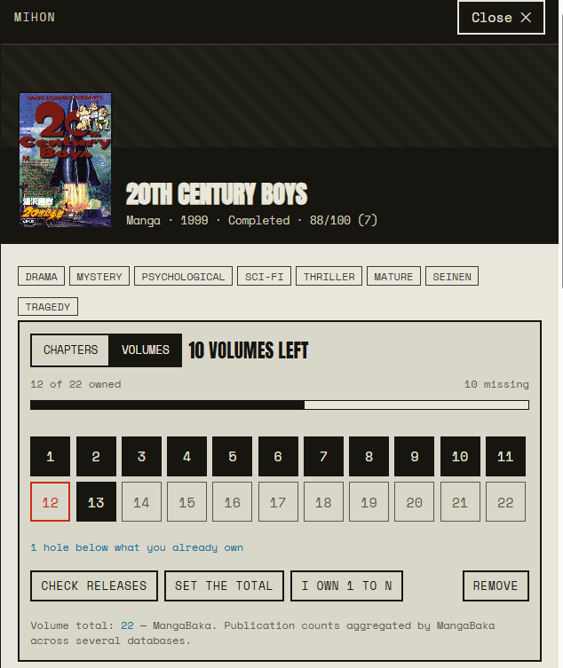
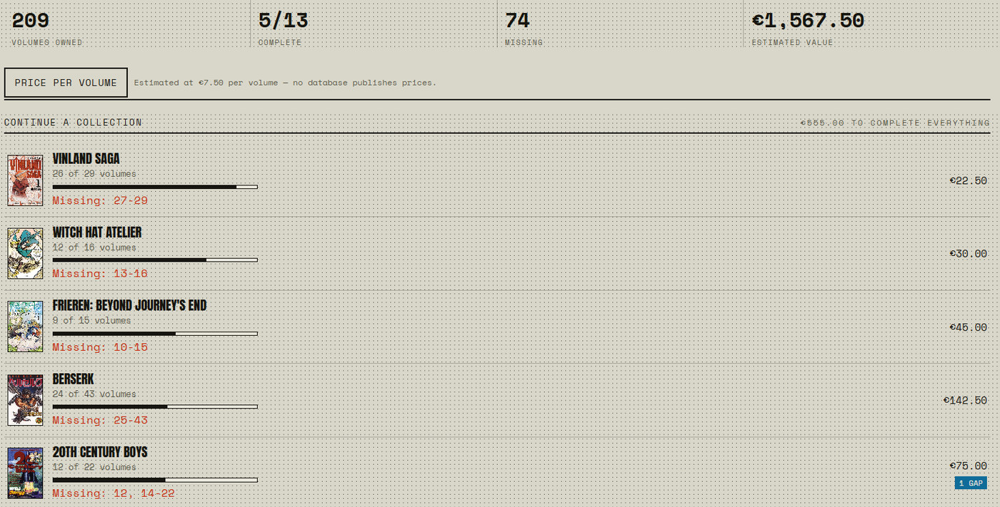

# Rayon

**Your manga library, the recommendations it earns you, and the volumes you are still missing —
in one page, stored on your own device.**

No account. No server. No sync. Open the link and it is yours.

**→ [nkoziel.github.io/rayon-app](https://nkoziel.github.io/rayon-app/)**



---

## Why it exists

Reading apps are good at reading. They are bad at the two questions you actually have between
series: *what should I read next*, and *which volume am I missing on the shelf*.

Rayon answers those two, and hands the reading itself to
**[Mihon](https://mihon.app/)** — which is free, excellent, and already installed.
Every series sheet has a *Search in Mihon* button that drops the title straight into its
cross-source search.

---

## What you get

### Recommendations that tell you *why*



Discover reads every series you have made progress in, asks what people who liked it also read,
and ranks what comes back from several of them at once. Each suggestion carries its evidence:

- **`691 readers`** — how many people have both series in their list
- **`28 shared tags`** — how much thematic ground they cover in common
- **`Same author`** — the strongest signal there is

You can filter by reason. Show me only what the tag graph suggests. Show me only what other
readers back. It also says which of *your* series produced each suggestion, so a bad
recommendation tells you something too.

Records come from **[MangaBaka](https://mangabaka.org/)**, which already aggregates AniList,
MyAnimeList, MangaUpdates, Kitsu, Anime-Planet, Shikimori and ANN — so ratings are averaged
across up to seven databases rather than taken from one.

### Progress tracking that admits what it does not know



Every series says **where its chapter count came from** and how much to trust it. MangaBaka's
aggregate, MangaDex's latest *translated* chapter, AniList (which publishes no total until a
series is finished), your backup's count, or your own entry — which always wins.

That line exists because "how many chapters exist" has no single reliable answer, and an app
that hides the difference is quietly lying to you. The full cascade, source by source, is in
[`docs/TOTALS.md`](docs/TOTALS.md).

### A shelf you can check while standing in the shop



Switch a series to **Volumes** and tracking becomes physical: tap the volumes you own. Gaps
*below* what you already own are flagged in red — the hole on the shelf is a different problem
from a volume you have not bought yet.



The **Shopping** tab turns that into a list: what is missing, what it would cost, sorted so the
nearly-finished collections come first. It renders entirely from local state, no network call —
because a bookshop is exactly where signal is bad.

### Your Mihon backup, understood properly

Drop a `.tachibk` in and it is decoded in the browser — gzip and protobuf, no upload, no server.

A backup is a record of the *app*, not of your library: it keeps every series you ever opened,
once per source. Migrate a title between two sources and it appears twice. Rayon folds those
back together, keeps the favourites, and takes the **highest** progress in each group — so a
series you read 393 chapters of on a source you abandoned does not come back at zero.

On one real 232-row backup: 118 series, 43 duplicate titles resolved, no progress lost.

---

## Getting started

**1. Open [the app](https://nkoziel.github.io/rayon-app/).** You land on an empty library.

**2. Fill it.** Either **Import** a Mihon/Tachiyomi `.tachibk` backup (or a `.json` export from
someone else), or use the **Add** tab to search titles one at a time.

**3. Install it.** Chrome on Android: ⋮ → *Add to home screen*. Safari on iPhone: Share →
*Add to Home Screen*. It then launches fullscreen with no address bar, and starts offline —
only metadata lookups need the network.

An **Android APK** is also published (`io.github.nkoziel.rayon`, ~0.9 MB), built with Bubblewrap
as a Trusted Web Activity — see [`docs/ANDROID.md`](docs/ANDROID.md) for the packaging routes and
the Mihon hand-off.

---

## Where your data lives

| | |
|---|---|
| **Your library and progress** | `localStorage`, on this device |
| **Records, totals, recommendations** | IndexedDB, on this device — regenerable cache |
| **Sent to a server** | nothing, except the titles you look up |

Two people on the same URL have two independent libraries. There is no account to create and
nothing to sign in to.

**Back it up.** *Export* writes a `.json` file — that is the only backup that exists, and it
doubles as the way to hand a reading list to a friend. *Erase everything* offers it first.

> **One honest caveat:** the page currently loads its fonts from Google Fonts, which discloses
> your IP address to Google on every open. Self-hosting them is planned.

---

## Running it yourself

`index.html` at the repo root is a single self-contained file. Open it straight from a clone and
everything works except installation and offline mode, which need an `http(s)://` origin.

To host it: any static host. GitHub Pages (configured here — pushing to `main` publishes),
Netlify Drop, Cloudflare Pages, Vercel. The only requirement is HTTPS, or the service worker
will not register.

---

## Developing

```bash
npm install
npm run dev        # Vite dev server on src/
npm run build      # src/ -> one self-contained index.html at the root
npm run verify     # tests + module structure + the published bundle
```

```
src/core/     dom, norm, store, state, i18n, volumes — no UI, no app flow
src/data/     mangabaka, anilist, mangadex, totals, recos — fetching and deriving
src/import/   tachibk (protobuf), library (import/merge/export/reset)
src/ui/       library, sheet, tracker, discover, add, shopping, mihon, why
index.html    generated single file, committed on purpose
```

> **The root `index.html` is a build artifact — edit `src/` and rebuild.** It is committed so a
> clone stays openable with no build step, and `npm run verify` fails if it falls behind `src/`.

The interface ships in **English, with French selectable** — both complete; a missing key in
either is a test failure, not a graceful fallback.

Further reading: **`REVIEW.md`** (technical review, numbered findings), **`CLAUDE.md`**
(conventions and the invariants not to break), [`docs/TOTALS.md`](docs/TOTALS.md) (the totals
cascade and the storage split), [`docs/ANDROID.md`](docs/ANDROID.md) (packaging).

---

## Credits

Records and recommendations from **[MangaBaka](https://mangabaka.org/)**
(CC BY-NC-SA 4.0 — this project is and stays non-commercial), with **AniList** as a fallback and
**MangaDex** for volume structure and translated-chapter counts. Reading happens in
**[Mihon](https://mihon.app/)**.
